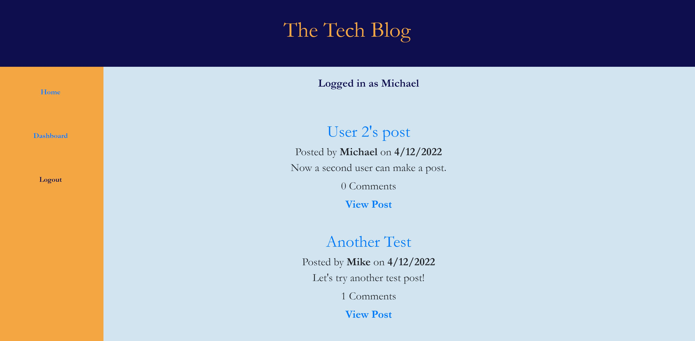

# Tech-Blog

This app is a simple tech blog, allowing users to post what they have written as well as view posts by other users on the homepage. Users can also comment on each other's posts, or go to the Dashboard to review all of their own posts.

The app is built using MVC structure with a database built using Sequelize, and Handlebars for the front-end display. It uses Dotenv, Bcrypt and Express, and is deployed through Heroku with the help of Jaws DB. 

